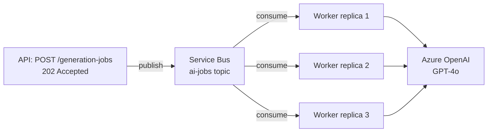
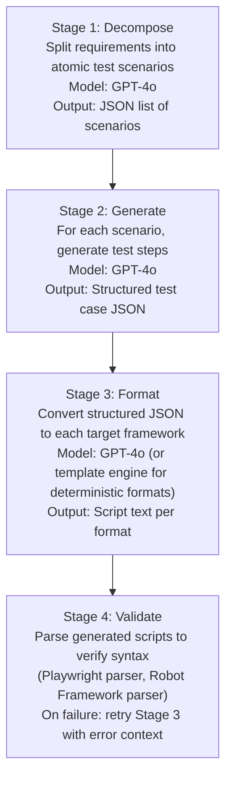

# ADR-003: Azure OpenAI Integration Approach

**Status:** Accepted  
**Date:** 2026-05-07  
**Deciders:** KIU AI Engineering Leadership

---

## Context

KAATS's core value proposition is AI-generated test scripts. The AI integration must:
- Produce syntactically valid, runnable test scripts in multiple frameworks.
- Handle requirements documents of varying length and quality.
- Be reliable (retries, timeouts, graceful degradation).
- Be cost-controlled per tenant.
- Not expose customer requirement content to non-Azure endpoints.

---

## Decision

Use **Azure OpenAI (GPT-4o deployment)** with **LangChain** for prompt orchestration, with a custom thin abstraction layer in the worker service.

---

## Architecture

### 1. Async Job Processing

AI generation is never synchronous from the HTTP perspective. The API accepts a generation request, immediately publishes a message to Azure Service Bus, and returns `202 Accepted`. The Worker Container App consumes the message and calls Azure OpenAI.

This decoupling ensures:
- API response times remain fast (<200ms).
- OpenAI API latency (2–30 seconds per completion) does not block HTTP threads.
- Multiple generation jobs process in parallel via competing consumer workers.



### 2. Prompt Architecture

Each generation job runs a multi-stage chain:



**Stage 1 — Decomposition prompt structure:**

```
System: You are an expert software test engineer specializing in acceptance test design.
        You produce structured JSON. Do not produce markdown, prose, or explanation.
        Tenant context: {company_name}, industry: {industry}.

User: Decompose the following software requirements into individual, atomic test scenarios.
      Each scenario must be independently testable.
      Requirements:
      ---
      {requirement_content}
      ---
      Output format:
      [{"scenario_id": "...", "title": "...", "preconditions": [...], "actors": [...], "priority": "HIGH|MEDIUM|LOW"}]
```

**Stage 3 — Framework formatting is deterministic when possible:**
- Gherkin/BDD output is generated by a Jinja2 template applied to the structured JSON from Stage 2, not by GPT-4o. This ensures consistent Cucumber-compatible syntax.
- Playwright JS/TS and Selenium Python are generated by GPT-4o with few-shot examples of well-structured scripts.

### 3. LangChain Usage

LangChain is used for:
- `ChatOpenAI` client with Azure endpoint configuration.
- `PromptTemplate` / `ChatPromptTemplate` for prompt management.
- `JsonOutputParser` for structured output parsing with retry on malformed JSON.
- `RunnableWithFallbacks` for automatic retry with exponential backoff on rate-limit errors.

LangChain is **not** used for:
- Agent loops (too unpredictable for production test generation).
- Vector store retrieval (requirements are passed directly in context; no RAG needed at MVP).
- Memory (stateless per-job; no conversation history).

A thin `AIService` abstraction class in the worker wraps all LangChain calls. This ensures:
- Swapping the LangChain version or provider requires changes in one file.
- All AI calls are instrumented with token usage logging and Application Insights traces.

### 4. Token and Cost Management

- **Per-tenant token tracking:** Every Azure OpenAI call logs `prompt_tokens`, `completion_tokens`, and `total_tokens` to Cosmos DB (`ai_generation_log` documents) and to the `jobs` table.
- **Tenant token limits:** Company Administrators can set a monthly token budget (stored in SQL). The Worker checks remaining budget before each generation call; if exhausted, the job fails gracefully with `TOKEN_LIMIT_EXCEEDED` status.
- **Context window management:** Requirements are chunked if they exceed `max_tokens_per_request` (configurable, default 100k for GPT-4o). The decomposition stage processes chunks independently and merges scenario lists.

### 5. Prompt Injection Mitigation

Customer requirement content is user-provided and must not be able to manipulate the system prompt:
- Requirement content is inserted into the `user` message role only, never the `system` message.
- The system prompt is immutable per deployment; any attempt to modify it requires a code deploy.
- Output is parsed as JSON; free-text instructions embedded in requirements cannot cause LangChain to execute arbitrary chains.

### 6. Retry and Resilience

```python
# Configured on the LangChain ChatOpenAI client
azure_openai_client = AzureChatOpenAI(
    azure_deployment="kaats-gpt4o",
    max_retries=3,
    request_timeout=120,
).with_retry(
    retry_if_exception_type=(RateLimitError, ServiceUnavailableError),
    wait_exponential_jitter=True,
    stop_after_attempt=3,
)
```

- On `RateLimitError` (429): exponential backoff with jitter, max 3 retries.
- On `ServiceUnavailableError` (503): immediate retry once, then fail the job (worker will redeliver from Service Bus dead-letter).
- Jobs that fail after all retries enter `FAILED` status with the error message captured; users can manually retry from the UI.

### 7. Output Quality Assurance

After generation, a lightweight validation pass runs:
- **Playwright scripts:** Attempt `import`-parse via `@playwright/test` AST parser (run in a sandboxed Node.js subprocess).
- **Python scripts (Selenium, Pytest):** Run `py_compile` to check syntax.
- **Robot Framework:** Parse with `robot.api` `get_model()`.
- **Gherkin:** Parse with `gherkin-official` parser (Node subprocess).

If any format fails validation, Stage 3 is retried for that format only, passing the parse error as additional context to GPT-4o.

---

## Consequences

**Positive:**
- Async job model means AI latency is invisible to the user interaction — they receive immediate feedback and check back when ready.
- Multi-stage decomposition produces higher-quality, more granular test scenarios than single-prompt generation.
- Token tracking enables billing reconciliation and cost attribution per tenant.

**Negative / Risks:**
- **LangChain API instability:** Mitigated by the `AIService` abstraction layer and pinned dependency versions. LangChain LCEL (LangChain Expression Language) is used, which is the stable modern API.
- **GPT-4o output variability:** Even with few-shot examples, generated scripts vary. The syntax validation + retry loop handles the most common failure mode (malformed output). Long-term, a fine-tuned model on accepted KAATS scripts could improve consistency.
- **Chunking complexity:** Very large requirements documents that require chunking introduce complexity in the merge step. MVP will reject requirements documents over 200KB with a clear error message; chunking is a v1.1 feature.
