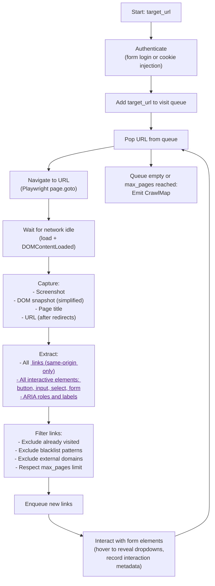
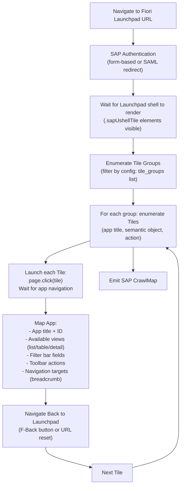

# ADR-004: Playwright Crawler Design

**Status:** Accepted  
**Date:** 2026-05-07  
**Deciders:** KIU AI Engineering Leadership

---

## Context

KAATS must crawl two distinct types of application:
1. **Generic Web UIs** — any modern web application reachable via HTTP/HTTPS.
2. **SAP Fiori Launchpad** — SAP's React/SAPUI5-based enterprise web frontend, with specific interaction patterns (tile groups, transactions, ABAP backend navigation).

The crawler's job is to map UI flows and feed them to the AI engine for test script generation — not to execute tests itself. The crawler must:
- Handle modern SPAs (React, Angular, Vue) with client-side routing.
- Navigate authentication forms.
- Produce a structured, serializable map of pages, actions, and flows.
- Capture screenshots and DOM snapshots as evidence.
- Run in a headless, containerized environment without a real display.
- Not crash the target application (conservative interaction model).

---

## Decision

Use **Playwright (Python async)** as the crawling engine for both Web UI and SAP Fiori targets.

---

## Rationale for Playwright

| Criterion | Playwright | Selenium | Puppeteer |
|---|---|---|---|
| Async Python support | Native (`asyncio`) | No (sync only or async wrappers) | N/A (Node.js) |
| SPA support | Excellent (auto-wait) | Poor (manual waits) | Good |
| Multi-browser | Yes (Chromium, Firefox, WebKit) | Yes | Chromium only |
| Network interception | Yes | Partial | Yes |
| Screenshot / trace | Built-in | Manual | Built-in |
| SAP Fiori compatibility | Good (Chromium + SAPUI5) | Acceptable | Good |
| Worker language match | Python (same as API) | Python | Node.js (mismatch) |

Playwright's `auto-wait` semantics are critical: it waits for elements to be actionable before interacting, dramatically reducing fragile timing issues in SPA crawling.

---

## Crawler Architecture

### Worker Process Model

Each crawl job runs in an isolated async Playwright browser context (not a new process — a new browser context within a shared Playwright browser instance). This provides:
- Session isolation between concurrent crawl jobs.
- Shared browser process overhead (one Chromium process per worker pod).
- Graceful cleanup: browser context is closed after job completion, even on error.

```python
async def run_crawl_job(job: CrawlJob, playwright: Playwright) -> CrawlMap:
    browser = await playwright.chromium.launch(headless=True)
    context = await browser.new_context(
        viewport={"width": 1920, "height": 1080},
        ignore_https_errors=job.ignore_tls_errors,
        record_video_dir=None,  # screenshots only, not video (storage cost)
    )
    try:
        crawler = WebCrawler(context, job) if job.crawler_type == "WEB" else SAPFioriCrawler(context, job)
        return await crawler.run()
    finally:
        await context.close()
        await browser.close()
```

### Web UI Crawler Algorithm

The web crawler uses a **breadth-first page traversal** with a configurable depth limit:



**Flow Detection:** After crawling, a flow stitching algorithm groups pages into logical user flows by analyzing:
- Navigation path (referrer chain captured during crawl).
- Shared form elements across consecutive pages.
- URL path prefixes (e.g., `/checkout/cart` → `/checkout/address` → `/checkout/confirm`).

### SAP Fiori Crawler Algorithm

SAP Fiori has a well-known structure that the crawler exploits:



SAP-specific interactions handled:
- **SAPUI5 Select controls** — standard HTML `<select>` is not used; Playwright uses the SAPUI5 ComboBox's `aria-label` to identify and interact with it.
- **Smart Tables** — detected by `.sapUiTable` class; columns are enumerated from the header row.
- **Navigation targets** — breadcrumb links and `sap-iapp-state` URL parameters are tracked to reconstruct the transaction flow graph.
- **Launchpad tile groups** — the `tile_groups` config list restricts crawling to specific SAP modules (e.g., `["MM60", "FI01"]`) to prevent unintended navigation.

### Authentication Strategies

| Auth Type | Mechanism |
|---|---|
| `form` | Playwright fills `username`/`password` fields, submits login form, waits for redirect |
| `basic` | HTTP Basic Auth header injected via `browser_context.set_http_credentials()` |
| `saml` | Navigate SAML redirect flow (IdP-initiated); credentials injected at IdP form |
| `cookie` | Pre-authenticated session cookie injected into browser context |
| `none` | No authentication (public apps or pre-configured proxy) |

Credentials are **never stored in the job payload**. The crawl job references a Key Vault secret name (e.g., `kaats-crawl-creds-projectX`). The Worker retrieves the credentials at job start, uses them in-memory, and discards them. They are never written to logs, Cosmos DB, or Blob Storage.

### Screenshot and Evidence Storage

- Screenshots are captured at each page visit in `JPEG` format (90% quality) to minimize storage.
- Stored in Blob Storage: `tenant-{tenant_id}/crawls/{job_id}/screenshots/{page_index:04d}.jpg`.
- DOM snapshots (simplified: text content + ARIA structure, not full HTML) are stored inline in the Cosmos DB crawl map document (max 1 MB per snapshot; truncated if larger).
- The total blob storage cost per crawl is bounded by `max_pages × ~50KB` (approximately 5 MB for a 100-page crawl).

### Crawl Scope Controls

| Config Parameter | Default | Purpose |
|---|---|---|
| `max_pages` | 100 | Hard limit on pages visited |
| `max_depth` | 5 | BFS depth limit from seed URL |
| `exclude_patterns` | `["/logout", "/sign-out"]` | Regex/glob patterns to skip |
| `same_origin_only` | `true` | Do not follow links to external domains |
| `interaction_delay_ms` | 500 | Throttle between page interactions |
| `page_load_timeout_ms` | 30000 | Fail page if not loaded within 30s |

These defaults prevent the crawler from inadvertently logging out the session, crawling external sites, or overwhelming the target server.

---

## Consequences

**Positive:**
- Playwright's Python async API integrates naturally with the async FastAPI/SQLAlchemy worker codebase.
- A single Playwright installation in the Worker Docker image handles both Web and SAP Fiori targets.
- Structured crawl map output feeds directly into the AI generation pipeline without manual intervention.
- Per-context isolation means a crashed crawl job does not affect other concurrent jobs.

**Negative / Risks:**
- **SAP Fiori version changes:** SAP UI component class names and ARIA structures may change across SAP release versions. The SAP Fiori crawler selectors must be maintained as SAP updates its components. Mitigated by using stable ARIA roles (`role="button"`, `role="combobox"`) wherever possible over class-name selectors.
- **Authentication complexity:** Complex SAML/SSO flows (multi-step MFA, redirect chains) may fail. MVP supports form, basic, and cookie auth. SAML is best-effort with a manual fallback to cookie injection.
- **JavaScript-heavy SPAs with infinite scroll or virtual lists:** The BFS algorithm may not capture all content. This is acceptable for MVP; future versions can include interaction scripting (scroll-to-bottom, expand-all patterns).
- **Anti-bot measures:** Some target applications may block Playwright. The crawler runs with `headless=True` and does not spoof browser headers beyond defaults. Customers must ensure their target environments allowlist the crawler's egress IP (NAT Gateway static IP).
