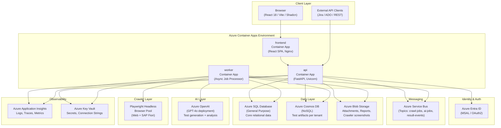
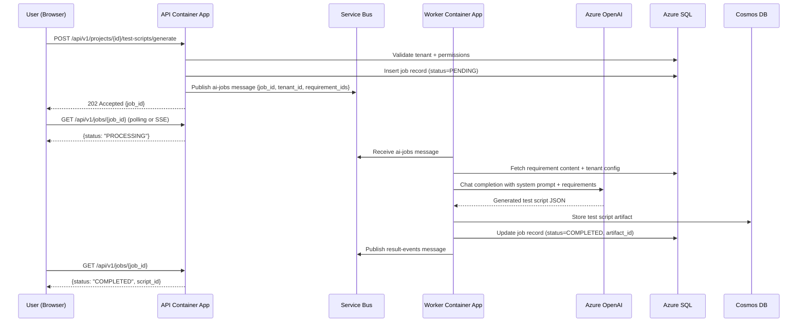
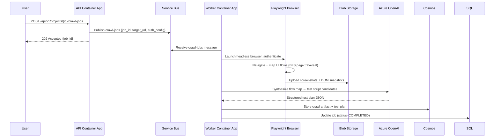
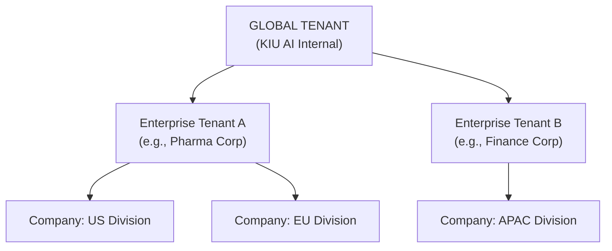
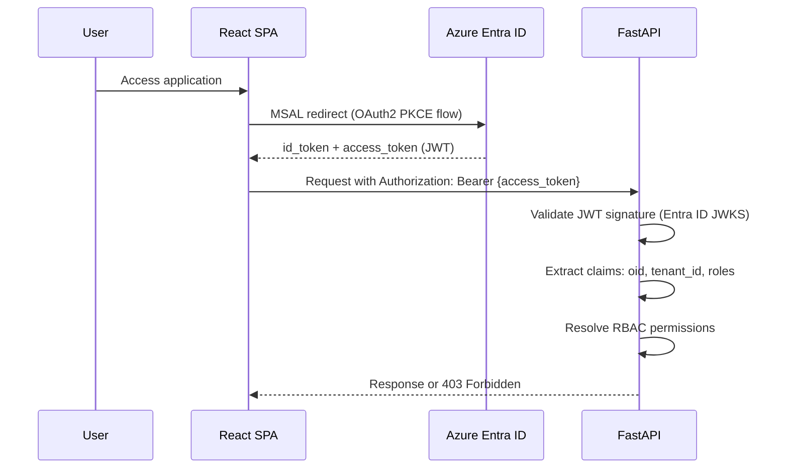

# KIU AI Automated Test System (KAATS) — Architecture Document

**Version:** 1.0  
**Date:** 2026-05-07  
**Status:** Approved

---

## 1. System Overview

KAATS is a multi-tenant, SaaS-delivered, AI-powered automated test generation and execution tracking platform. It ingests software requirements or crawls live applications, uses Azure OpenAI (GPT-4o) to generate executable test scripts in multiple formats, and tracks the full test lifecycle from authoring through execution and reporting.

### 1.1 Core Value Proposition

- **Accelerate test authoring** — AI generates structured test scripts from natural-language requirements in seconds.
- **Broaden coverage** — Playwright-based crawlers map real UI flows and SAP Fiori transactions to ensure test fidelity.
- **Multi-format portability** — Generated scripts are exported as Playwright JS/TS, Selenium Python, Pytest, Robot Framework, or Gherkin/BDD.
- **Enterprise governance** — Three-tier tenant hierarchy, role-based access control, and full audit trails satisfy regulated-industry validation requirements (e.g., GxP, SOX).

---

## 2. Architectural Principles

| Principle | Application |
|---|---|
| **Tenant isolation** | Every database row carries a `tenant_id`; Azure Cosmos DB and Blob Storage are partitioned per tenant. No cross-tenant data leakage is possible at the application layer. |
| **Async-first** | Long-running AI generation and crawler jobs are offloaded to Azure Service Bus workers. The API never blocks on AI calls. |
| **Least privilege** | Each Azure Container App has its own Managed Identity; Key Vault access policies are scoped to individual secrets. |
| **Schema-versioned** | All database migrations are managed by Alembic; Cosmos DB schema evolution is versioned via a `schema_version` field on documents. |
| **Observability by default** | Every service emits structured logs (structlog → Application Insights), distributed traces, and custom metrics from day one. |
| **Twelve-factor app** | Config from environment / Key Vault; stateless compute; backing services via connection strings. |

---

## 3. Component Architecture

### 3.1 High-Level Component Diagram

### 3.2 Request Flow — AI Test Generation

### 3.3 Request Flow — Web Crawler

---

## 4. Three-Tier Tenancy Model

- **Global** — the KAATS platform operator. Global Administrators manage enterprises, platform config, and cross-tenant observability.
- **Enterprise** — a contracted customer organization (e.g., a pharma company). Enterprise Administrators manage companies within their enterprise and set enterprise-wide policies.
- **Company** — an operational business unit. All day-to-day testing activity occurs within a Company context. Company Administrators manage users, projects, and environments.

Every API request includes a resolved `tenant_id` derived from the authenticated user's JWT claims. The middleware enforces that data access never crosses tenant boundaries.

---

## 5. Data Architecture Summary

| Store | Role | Isolation |
|---|---|---|
| Azure SQL | Relational core (users, projects, requirements, jobs, executions, audit) | `tenant_id` column + row-level security policy |
| Azure Cosmos DB | Test script artifacts, crawl maps, AI prompt/response logs | Separate container per tenant (`kaats-{tenant_id}`) |
| Azure Blob Storage | Binary attachments, screenshots, generated reports (PDF/HTML) | Separate container per tenant (`tenant-{tenant_id}`) |

See `/docs/DATA_MODEL.md` for full entity descriptions.

---

## 6. Security Architecture

### 6.1 Authentication Flow

### 6.2 Network Security

- All Container Apps are in a managed virtual network with private endpoints to Azure SQL, Cosmos DB, Service Bus, Key Vault, and Blob Storage.
- Public internet access is only via the frontend Container App (HTTPS/443) and API Container App (HTTPS/443) through Azure API Management or Application Gateway.
- Playwright worker pods have outbound internet access for crawling target applications, routed through Azure NAT Gateway with a static IP (for IP allowlisting by target systems).

### 6.3 Secrets Management

- All secrets (DB connection strings, OpenAI API key, Service Bus connection strings) are stored in Azure Key Vault.
- Container Apps reference Key Vault secrets via Managed Identity — no secrets in environment variables or image layers.
- Key Vault access is audited; all secret reads appear in Application Insights.

---

## 7. Observability Architecture

| Signal | Tool | Key Metrics |
|---|---|---|
| Structured logs | structlog → Application Insights | Request/response, job lifecycle, AI token usage, crawler page count |
| Distributed traces | OpenTelemetry → Application Insights | End-to-end latency per job, per-tenant breakdown |
| Metrics | Azure Monitor | Queue depth, worker processing rate, AI error rate, test pass/fail rate |
| Alerts | Azure Monitor Alert Rules | Queue depth > 500, AI error rate > 5%, job stuck > 30min |

All log records include: `tenant_id`, `user_id`, `request_id`, `component`, `environment`.

---

## 8. CI/CD Pipeline

```mermaid
graph LR
    PR["Pull Request"] --> Lint["Ruff + ESLint\nMypy + tsc"]
    Lint --> Tests["Pytest (unit + integration)\nVitest (unit)"]
    Tests --> Build["Docker build\n(api, worker, frontend)"]
    Build --> SBOM["Trivy SBOM scan"]
    SBOM --> Push["Push to\nAzure Container Registry"]
    Push --> DeployDev["Deploy → dev\n(auto on main)"]
    DeployDev --> E2E["Playwright E2E\nsuite"]
    E2E --> DeployProd["Deploy → prod\n(manual approval)"]
```

- GitHub Actions workflows live in `.github/workflows/`.
- Azure Bicep IaC in `/infra/` provisions all Azure resources. Infrastructure changes go through a `bicep what-if` preview step before apply.
- Container image tags use the full Git SHA for immutability and traceability.

---

## 9. Scaling Strategy

| Component | Scaling Mechanism |
|---|---|
| API Container App | HTTP-driven autoscale (0 → 10 replicas, scale on concurrent requests) |
| Worker Container App | KEDA Service Bus trigger (0 → 20 replicas, scale on queue depth) |
| Frontend Container App | Static assets served by Nginx; scale on HTTP concurrency |
| Azure SQL | General Purpose tier; can scale vCores independently of storage |
| Cosmos DB | Autoscale throughput (RU/s) per container; burstable for tenant spikes |

The worker scales to zero when no jobs are queued, minimizing cost during off-hours.

---

## 10. Disaster Recovery

| Component | RPO | RTO | Strategy |
|---|---|---|---|
| Azure SQL | 5 min | 1 hr | Geo-redundant backups; point-in-time restore |
| Cosmos DB | Near-zero | < 1 hr | Multi-region writes optional; geo-redundancy enabled |
| Blob Storage | Near-zero | < 1 hr | RA-GRS replication |
| Container Apps | N/A | 15 min | Redeploy from ACR via GitHub Actions |
| Secrets | N/A | 15 min | Key Vault soft-delete + purge protection; cross-region backup |
