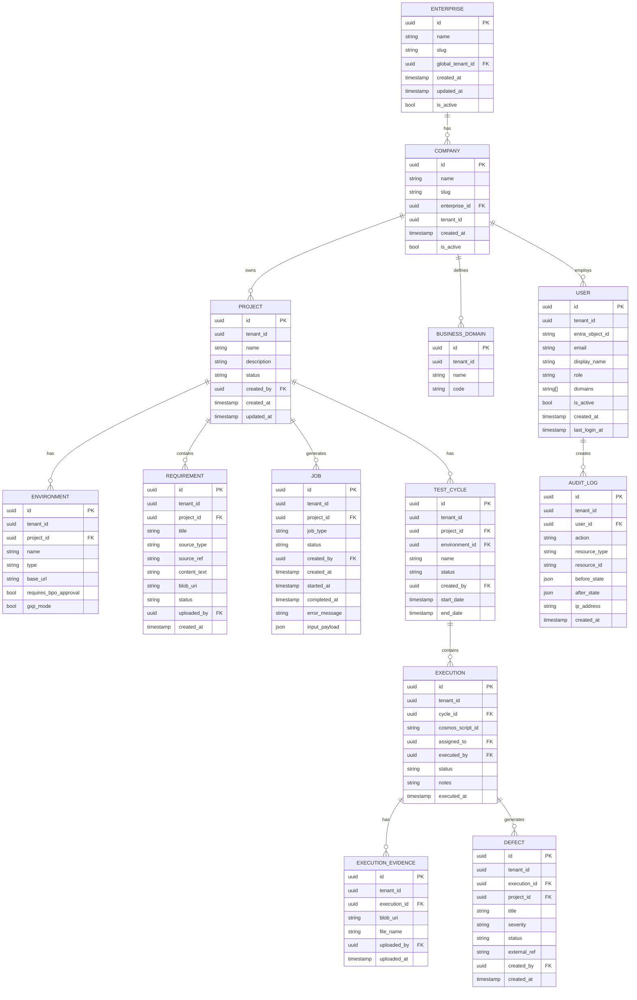

# KAATS — Data Model

**Version:** 1.0  
**Date:** 2026-05-07

---

## 1. Overview

KAATS uses two complementary data stores:

- **Azure SQL Database** — relational core for structured, transactional data: users, projects, requirements, jobs, execution records, and audit trails. Row-level security via `tenant_id` ensures tenant isolation.
- **Azure Cosmos DB** — document store for variable-schema AI artifacts: generated test scripts, crawler maps, AI prompt/response logs. One Cosmos container per tenant.

Binary files (screenshots, attachments, exported reports) live in **Azure Blob Storage** in a tenant-scoped container; SQL and Cosmos documents store only the blob URI.

---

## 2. Tenant Isolation Strategy

### 2.1 Azure SQL

Every table has a `tenant_id UUID NOT NULL` column. A row-level security (RLS) policy is applied at the database level:

```sql
-- Security predicate function
CREATE FUNCTION security.fn_tenant_predicate(@tenant_id UUID)
RETURNS TABLE
WITH SCHEMABINDING
AS
RETURN SELECT 1 AS fn_result
WHERE @tenant_id = CAST(SESSION_CONTEXT(N'tenant_id') AS UUID);

-- Applied to every tenant-scoped table, e.g.:
CREATE SECURITY POLICY security.tenant_policy
ADD FILTER PREDICATE security.fn_tenant_predicate(tenant_id) ON dbo.projects,
ADD BLOCK PREDICATE  security.fn_tenant_predicate(tenant_id) ON dbo.projects;
```

The FastAPI middleware sets `SESSION_CONTEXT` on every connection checkout from the SQLAlchemy async pool. Global Administrator queries bypass RLS by connecting with a privileged user that has the `db_owner` role.

### 2.2 Cosmos DB

Each tenant gets its own Cosmos DB container named `kaats-{tenant_id}`. The partition key within each container is `/project_id`. This provides:
- Physical isolation of tenant data.
- Per-tenant throughput controls (autoscale RU/s).
- Independent TTL policies (e.g., auto-expire AI prompt logs after 90 days).

### 2.3 Blob Storage

Each tenant gets a dedicated container: `tenant-{tenant_id}`. Access is granted only to the Managed Identity of the API and Worker apps, scoped to the specific tenant container via Azure RBAC (`Storage Blob Data Contributor` on the container resource).

---

## 3. Entity Relationship Diagram



---

## 4. Azure SQL Table Specifications

### 4.1 `enterprises`

| Column | Type | Constraints | Notes |
|---|---|---|---|
| `id` | UUID | PK | |
| `name` | NVARCHAR(255) | NOT NULL | |
| `slug` | NVARCHAR(100) | UNIQUE, NOT NULL | URL-safe identifier |
| `global_tenant_id` | UUID | FK | References platform-level tenant |
| `created_at` | DATETIMEOFFSET | NOT NULL | |
| `updated_at` | DATETIMEOFFSET | NOT NULL | |
| `is_active` | BIT | NOT NULL, DEFAULT 1 | |

### 4.2 `companies`

| Column | Type | Constraints | Notes |
|---|---|---|---|
| `id` | UUID | PK | |
| `enterprise_id` | UUID | FK enterprises(id) | |
| `tenant_id` | UUID | UNIQUE, NOT NULL | Used in all RLS policies |
| `name` | NVARCHAR(255) | NOT NULL | |
| `slug` | NVARCHAR(100) | UNIQUE, NOT NULL | |
| `created_at` | DATETIMEOFFSET | NOT NULL | |
| `is_active` | BIT | NOT NULL, DEFAULT 1 | |

### 4.3 `users`

| Column | Type | Constraints | Notes |
|---|---|---|---|
| `id` | UUID | PK | |
| `tenant_id` | UUID | NOT NULL | RLS column |
| `entra_object_id` | NVARCHAR(255) | UNIQUE, NOT NULL | Azure AD OID |
| `email` | NVARCHAR(320) | NOT NULL | |
| `display_name` | NVARCHAR(255) | NOT NULL | |
| `role` | NVARCHAR(50) | NOT NULL | Enum: GADM, EADM, CADM, SM, VL, QA, VT, BPO |
| `domains` | NVARCHAR(MAX) | NULL | JSON array of domain codes |
| `is_active` | BIT | NOT NULL, DEFAULT 1 | |
| `created_at` | DATETIMEOFFSET | NOT NULL | |
| `last_login_at` | DATETIMEOFFSET | NULL | |

### 4.4 `projects`

| Column | Type | Constraints | Notes |
|---|---|---|---|
| `id` | UUID | PK | |
| `tenant_id` | UUID | NOT NULL | RLS column |
| `name` | NVARCHAR(255) | NOT NULL | |
| `description` | NVARCHAR(MAX) | NULL | |
| `status` | NVARCHAR(50) | NOT NULL | ACTIVE, ARCHIVED |
| `created_by` | UUID | FK users(id) | |
| `created_at` | DATETIMEOFFSET | NOT NULL | |
| `updated_at` | DATETIMEOFFSET | NOT NULL | |

### 4.5 `requirements`

| Column | Type | Constraints | Notes |
|---|---|---|---|
| `id` | UUID | PK | |
| `tenant_id` | UUID | NOT NULL | RLS column |
| `project_id` | UUID | FK projects(id) | |
| `title` | NVARCHAR(500) | NOT NULL | |
| `source_type` | NVARCHAR(50) | NOT NULL | TEXT, DOCX, PDF, JIRA, ADO |
| `source_ref` | NVARCHAR(500) | NULL | Jira issue key, ADO work item ID, etc. |
| `content_text` | NVARCHAR(MAX) | NULL | Extracted text content |
| `blob_uri` | NVARCHAR(1000) | NULL | Original file in Blob Storage |
| `status` | NVARCHAR(50) | NOT NULL | PENDING, PROCESSED, FAILED |
| `domain_code` | NVARCHAR(100) | NULL | Business domain assignment |
| `uploaded_by` | UUID | FK users(id) | |
| `created_at` | DATETIMEOFFSET | NOT NULL | |

### 4.6 `jobs`

| Column | Type | Constraints | Notes |
|---|---|---|---|
| `id` | UUID | PK | |
| `tenant_id` | UUID | NOT NULL | RLS column |
| `project_id` | UUID | FK projects(id) | |
| `job_type` | NVARCHAR(50) | NOT NULL | AI_GENERATION, WEB_CRAWL, SAP_CRAWL, EXPORT |
| `status` | NVARCHAR(50) | NOT NULL | PENDING, PROCESSING, COMPLETED, FAILED, CANCELLED |
| `created_by` | UUID | FK users(id) | |
| `created_at` | DATETIMEOFFSET | NOT NULL | |
| `started_at` | DATETIMEOFFSET | NULL | |
| `completed_at` | DATETIMEOFFSET | NULL | |
| `error_message` | NVARCHAR(MAX) | NULL | |
| `input_payload` | NVARCHAR(MAX) | NULL | JSON: requirement IDs, target URL, config |
| `cosmos_result_id` | NVARCHAR(500) | NULL | ID of result document in Cosmos DB |

### 4.7 `test_cycles`

| Column | Type | Constraints | Notes |
|---|---|---|---|
| `id` | UUID | PK | |
| `tenant_id` | UUID | NOT NULL | RLS column |
| `project_id` | UUID | FK projects(id) | |
| `environment_id` | UUID | FK environments(id) | |
| `name` | NVARCHAR(255) | NOT NULL | |
| `status` | NVARCHAR(50) | NOT NULL | DRAFT, ACTIVE, COMPLETED, LOCKED |
| `created_by` | UUID | FK users(id) | |
| `start_date` | DATE | NULL | |
| `end_date` | DATE | NULL | |

### 4.8 `executions`

| Column | Type | Constraints | Notes |
|---|---|---|---|
| `id` | UUID | PK | |
| `tenant_id` | UUID | NOT NULL | RLS column |
| `cycle_id` | UUID | FK test_cycles(id) | |
| `cosmos_script_id` | NVARCHAR(500) | NOT NULL | Document ID in tenant Cosmos container |
| `script_version` | INT | NOT NULL | Snapshot of version at assignment time |
| `assigned_to` | UUID | FK users(id) | |
| `executed_by` | UUID | FK users(id) NULL | |
| `status` | NVARCHAR(50) | NOT NULL | NOT_STARTED, IN_PROGRESS, PASSED, FAILED, BLOCKED, SKIPPED |
| `notes` | NVARCHAR(MAX) | NULL | |
| `executed_at` | DATETIMEOFFSET | NULL | |

### 4.9 `audit_logs`

| Column | Type | Constraints | Notes |
|---|---|---|---|
| `id` | UUID | PK | |
| `tenant_id` | UUID | NOT NULL | RLS column |
| `user_id` | UUID | NOT NULL | |
| `action` | NVARCHAR(100) | NOT NULL | CREATE, READ, UPDATE, DELETE, APPROVE, EXECUTE |
| `resource_type` | NVARCHAR(100) | NOT NULL | project, requirement, test_script, execution, etc. |
| `resource_id` | NVARCHAR(500) | NOT NULL | UUID or Cosmos document ID |
| `before_state` | NVARCHAR(MAX) | NULL | JSON snapshot |
| `after_state` | NVARCHAR(MAX) | NULL | JSON snapshot |
| `ip_address` | NVARCHAR(45) | NULL | |
| `created_at` | DATETIMEOFFSET | NOT NULL | Indexed, never updated |

---

## 5. Cosmos DB Document Schemas

All documents include a `schema_version` field to support schema evolution.

### 5.1 Test Script Document

```json
{
  "id": "ts-<uuid>",
  "schema_version": 1,
  "type": "test_script",
  "project_id": "<uuid>",
  "tenant_id": "<uuid>",
  "title": "Login with valid credentials",
  "description": "Validates successful login flow",
  "status": "APPROVED",
  "version": 3,
  "version_history": [
    { "version": 1, "created_at": "...", "created_by": "<uuid>", "blob_uri": "..." }
  ],
  "tags": ["authentication", "smoke"],
  "domain_code": "USER_MANAGEMENT",
  "source_job_id": "<uuid>",
  "requirement_ids": ["<uuid1>", "<uuid2>"],
  "scripts": {
    "playwright_ts": "import { test, expect } from '@playwright/test';\n...",
    "playwright_js": "const { test, expect } = require('@playwright/test');\n...",
    "selenium_python": "from selenium import webdriver\n...",
    "pytest": "import pytest\n...",
    "robot_framework": "*** Settings ***\n...",
    "gherkin": "Feature: Login\n  Scenario: Valid credentials\n..."
  },
  "metadata": {
    "ai_model": "gpt-4o",
    "ai_prompt_tokens": 1243,
    "ai_completion_tokens": 892,
    "generation_duration_ms": 4200
  },
  "created_at": "2026-05-07T10:00:00Z",
  "updated_at": "2026-05-07T11:30:00Z",
  "created_by": "<uuid>",
  "approved_by": "<uuid>",
  "approved_at": "2026-05-07T12:00:00Z"
}
```

### 5.2 Crawl Map Document

```json
{
  "id": "crawl-<uuid>",
  "schema_version": 1,
  "type": "crawl_map",
  "job_id": "<uuid>",
  "project_id": "<uuid>",
  "tenant_id": "<uuid>",
  "crawler_type": "WEB",
  "target_url": "https://app.example.com",
  "pages_visited": 47,
  "flows": [
    {
      "flow_id": "flow-001",
      "name": "User Registration",
      "steps": [
        { "step": 1, "action": "navigate", "url": "/register" },
        { "step": 2, "action": "fill", "selector": "#email", "value": "{{email}}" },
        { "step": 3, "action": "click", "selector": "button[type=submit]" }
      ],
      "screenshot_uris": ["https://blob.../screenshot-001.png"]
    }
  ],
  "created_at": "2026-05-07T09:00:00Z"
}
```

### 5.3 AI Generation Log Document

```json
{
  "id": "ailog-<uuid>",
  "schema_version": 1,
  "type": "ai_generation_log",
  "job_id": "<uuid>",
  "tenant_id": "<uuid>",
  "model": "gpt-4o",
  "deployment": "kaats-gpt4o",
  "system_prompt": "You are a test engineer...",
  "user_prompt": "Generate test scripts for the following requirements...",
  "response_raw": "...",
  "token_usage": {
    "prompt_tokens": 1243,
    "completion_tokens": 892,
    "total_tokens": 2135
  },
  "duration_ms": 4200,
  "created_at": "2026-05-07T10:00:00Z",
  "_ttl": 7776000
}
```

`_ttl` (90 days in seconds) causes Cosmos DB to auto-expire AI logs, managing storage costs while retaining audit data in Azure SQL.

---

## 6. Indexing Strategy

### Azure SQL Key Indexes

| Table | Index | Purpose |
|---|---|---|
| All tables | `(tenant_id, id)` | Primary filtered lookup; supports RLS |
| `requirements` | `(tenant_id, project_id, status)` | Project requirements listing |
| `jobs` | `(tenant_id, status, created_at DESC)` | Job queue monitoring |
| `executions` | `(tenant_id, cycle_id, status)` | Cycle progress tracking |
| `audit_logs` | `(tenant_id, created_at DESC)` | Audit trail queries |

### Cosmos DB Indexes

Default indexing policy is used with the following custom inclusions:
- `/status/?` — filter by script status
- `/tags/*` — array contains queries
- `/domain_code/?` — BPO domain filtering
- `/created_at/?` — time-range queries

---

## 7. Data Retention Policy

| Data | Retention | Mechanism |
|---|---|---|
| AI generation logs (Cosmos) | 90 days | Cosmos TTL |
| Audit logs (SQL) | 7 years | No delete; archive to cold storage after 1 year |
| Execution evidence (Blob) | 7 years | Blob lifecycle policy (hot → cool → archive) |
| Crawler screenshots (Blob) | 30 days | Blob lifecycle delete policy |
| Test scripts (Cosmos) | Indefinite | Manual delete by Company Admin |
| Job records (SQL) | 1 year | Scheduled cleanup job |
