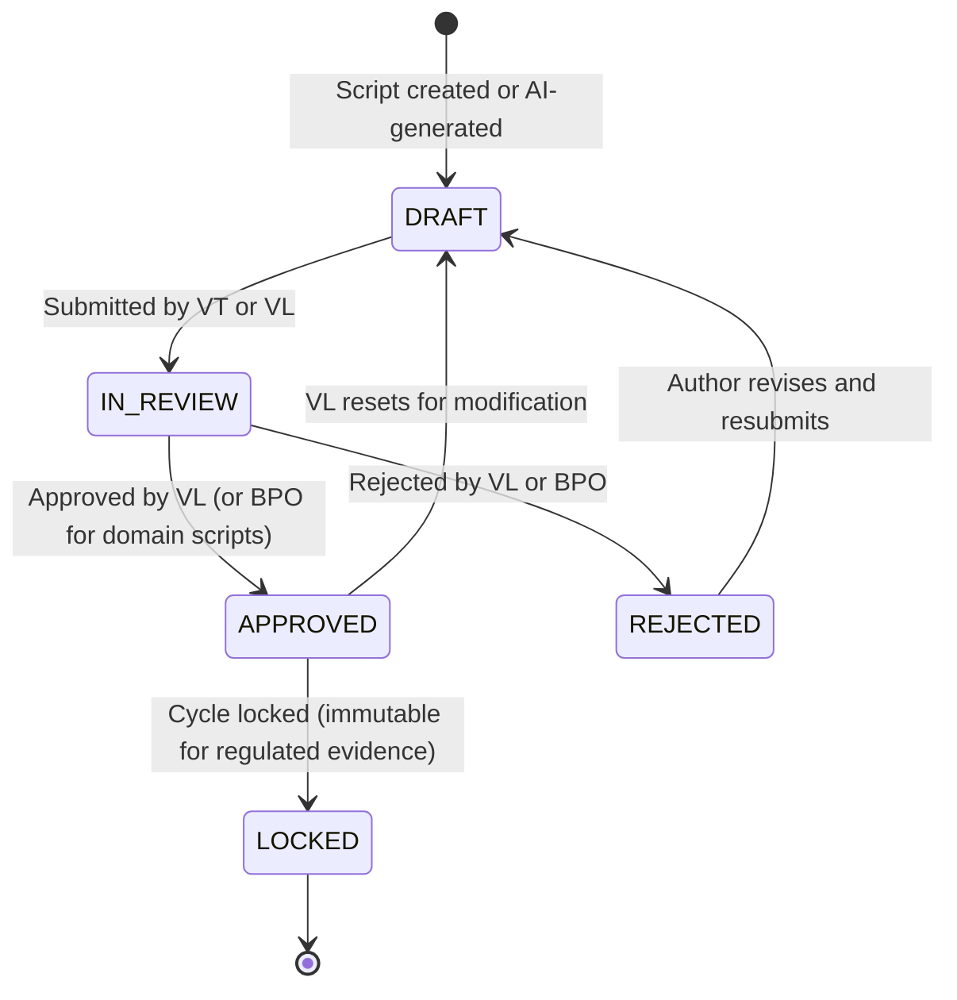

# KAATS — Role-Based Access Control (RBAC) Matrix

**Version:** 1.0  
**Date:** 2026-05-07

---

## 1. Role Definitions

| Role | Abbreviation | Scope | Description |
|---|---|---|---|
| Global Administrator | GADM | Platform | Full access across all tenants, all enterprises, all companies. KIU AI staff only. |
| Enterprise Administrator | EADM | Enterprise | Full access within their contracted enterprise tenant. Manages companies and enterprise-level settings. |
| Company Administrator | CADM | Company | Full access within their company. Manages users, projects, and environments. |
| System Manager | SM | Company | Project and environment management. Does not manage users or billing. |
| Validation Lead | VL | Project | Test cycle management, script approval workflow, tester assignment. |
| Quality Assurance | QA | Project | Test execution, result logging, defect creation. Cannot approve scripts. |
| Validation Tester | VT | Project | Test script authoring and editing; can execute assigned scripts only. |
| Business Process Owner | BPO | Domain | Read-only access to results and artifacts within their assigned business domain. Can submit approval decisions on review-gated scripts. |

---

## 2. Permission Matrix

### 2.1 Legend

| Symbol | Meaning |
|---|---|
| **✓** | Full access (create, read, update, delete) |
| **R** | Read only |
| **C** | Create only |
| **RU** | Read + Update |
| **RC** | Read + Create |
| **Assigned** | Only records explicitly assigned to this user |
| **Domain** | Only records within user's business domain |
| **—** | No access |

---

### 2.2 Tenant & User Management

| Feature | GADM | EADM | CADM | SM | VL | QA | VT | BPO |
|---|---|---|---|---|---|---|---|---|
| Manage enterprises (create/update/delete) | **✓** | — | — | — | — | — | — | — |
| View all enterprises | **✓** | — | — | — | — | — | — | — |
| Manage companies within enterprise | **✓** | **✓** | — | — | — | — | — | — |
| View companies within enterprise | **✓** | **✓** | R | — | — | — | — | — |
| Manage users within company | **✓** | **✓** | **✓** | — | — | — | — | — |
| View users within company | **✓** | **✓** | **✓** | R | R | — | — | — |
| Assign roles within company | **✓** | **✓** | **✓** | — | — | — | — | — |
| Manage business domains | **✓** | **✓** | **✓** | — | — | — | — | — |
| View billing & subscription | **✓** | **✓** | R | — | — | — | — | — |
| Platform-wide configuration | **✓** | — | — | — | — | — | — | — |
| Audit log access (all tenants) | **✓** | — | — | — | — | — | — | — |
| Audit log access (own tenant) | **✓** | **✓** | **✓** | — | — | — | — | — |

---

### 2.3 Project & Environment Management

| Feature | GADM | EADM | CADM | SM | VL | QA | VT | BPO |
|---|---|---|---|---|---|---|---|---|
| Create / delete projects | **✓** | **✓** | **✓** | **✓** | — | — | — | — |
| Edit project settings | **✓** | **✓** | **✓** | **✓** | — | — | — | — |
| View projects | **✓** | **✓** | **✓** | **✓** | **✓** | **✓** | **✓** | **Domain** |
| Manage environments (dev/QA/prod) | **✓** | **✓** | **✓** | **✓** | — | — | — | — |
| View environments | **✓** | **✓** | **✓** | **✓** | **✓** | **✓** | **✓** | R |
| Manage integrations (Jira/ADO) | **✓** | **✓** | **✓** | **✓** | — | — | — | — |
| Archive / restore projects | **✓** | **✓** | **✓** | **✓** | — | — | — | — |

---

### 2.4 Requirements Ingestion

| Feature | GADM | EADM | CADM | SM | VL | QA | VT | BPO |
|---|---|---|---|---|---|---|---|---|
| Upload requirements (text/docx/PDF) | **✓** | **✓** | **✓** | **✓** | **✓** | — | **✓** | — |
| Import from Jira / ADO | **✓** | **✓** | **✓** | **✓** | **✓** | — | — | — |
| View requirements | **✓** | **✓** | **✓** | **✓** | **✓** | **✓** | **✓** | **Domain** |
| Edit requirements | **✓** | **✓** | **✓** | **✓** | **✓** | — | **✓** | — |
| Delete requirements | **✓** | **✓** | **✓** | **✓** | — | — | — | — |
| Tag / categorize requirements | **✓** | **✓** | **✓** | **✓** | **✓** | — | **✓** | — |

---

### 2.5 AI Test Generation

| Feature | GADM | EADM | CADM | SM | VL | QA | VT | BPO |
|---|---|---|---|---|---|---|---|---|
| Trigger AI test generation | **✓** | **✓** | **✓** | **✓** | **✓** | — | **✓** | — |
| View generation job status | **✓** | **✓** | **✓** | **✓** | **✓** | **✓** | **✓** | — |
| View AI prompt/response log | **✓** | **✓** | **✓** | **✓** | **✓** | — | — | — |
| Configure AI generation settings | **✓** | **✓** | **✓** | **✓** | — | — | — | — |
| Cancel / retry generation jobs | **✓** | **✓** | **✓** | **✓** | **✓** | — | — | — |
| View token usage metrics | **✓** | **✓** | **✓** | R | — | — | — | — |

---

### 2.6 Crawler Management

| Feature | GADM | EADM | CADM | SM | VL | QA | VT | BPO |
|---|---|---|---|---|---|---|---|---|
| Configure crawl targets (Web / SAP Fiori) | **✓** | **✓** | **✓** | **✓** | — | — | — | — |
| Trigger crawl jobs | **✓** | **✓** | **✓** | **✓** | **✓** | — | — | — |
| View crawl job status & results | **✓** | **✓** | **✓** | **✓** | **✓** | **✓** | — | — |
| View crawler screenshots / DOM snapshots | **✓** | **✓** | **✓** | **✓** | **✓** | — | — | — |
| Cancel crawl jobs | **✓** | **✓** | **✓** | **✓** | **✓** | — | — | — |
| Manage crawler credentials (stored in Key Vault) | **✓** | **✓** | **✓** | **✓** | — | — | — | — |

---

### 2.7 Test Script Repository

| Feature | GADM | EADM | CADM | SM | VL | QA | VT | BPO |
|---|---|---|---|---|---|---|---|---|
| Create test scripts (manual) | **✓** | **✓** | **✓** | **✓** | **✓** | — | **✓** | — |
| View test scripts | **✓** | **✓** | **✓** | **✓** | **✓** | **✓** | **✓** | **Domain** |
| Edit test scripts | **✓** | **✓** | **✓** | **✓** | **✓** | — | **✓** | — |
| Delete test scripts | **✓** | **✓** | **✓** | **✓** | — | — | — | — |
| Submit script for approval | **✓** | **✓** | **✓** | **✓** | **✓** | — | **✓** | — |
| Approve / reject test scripts | **✓** | **✓** | **✓** | — | **✓** | — | — | **Domain** |
| View script version history | **✓** | **✓** | **✓** | **✓** | **✓** | **✓** | **✓** | — |
| Restore previous script version | **✓** | **✓** | **✓** | **✓** | **✓** | — | — | — |
| Tag / search scripts | **✓** | **✓** | **✓** | **✓** | **✓** | **✓** | **✓** | **Domain** |
| Export scripts (all formats) | **✓** | **✓** | **✓** | **✓** | **✓** | **✓** | **Assigned** | — |
| Bulk import / export scripts | **✓** | **✓** | **✓** | **✓** | — | — | — | — |

---

### 2.8 Test Cycle & Execution Management

| Feature | GADM | EADM | CADM | SM | VL | QA | VT | BPO |
|---|---|---|---|---|---|---|---|---|
| Create test cycles | **✓** | **✓** | **✓** | **✓** | **✓** | — | — | — |
| Edit test cycle settings | **✓** | **✓** | **✓** | **✓** | **✓** | — | — | — |
| Delete test cycles | **✓** | **✓** | **✓** | **✓** | — | — | — | — |
| Assign scripts to testers in cycle | **✓** | **✓** | **✓** | **✓** | **✓** | — | — | — |
| View test cycle status | **✓** | **✓** | **✓** | **✓** | **✓** | **✓** | **✓** | **Domain** |
| Execute assigned test scripts | **✓** | **✓** | **✓** | **✓** | **✓** | **✓** | **Assigned** | — |
| Log test execution results (pass/fail/blocked) | **✓** | **✓** | **✓** | **✓** | **✓** | **✓** | **Assigned** | — |
| Upload execution evidence (screenshots) | **✓** | **✓** | **✓** | **✓** | **✓** | **✓** | **Assigned** | — |
| Override / reassign execution results | **✓** | **✓** | **✓** | **✓** | **✓** | — | — | — |
| Close / lock test cycle | **✓** | **✓** | **✓** | **✓** | **✓** | — | — | — |

---

### 2.9 Defect Management

| Feature | GADM | EADM | CADM | SM | VL | QA | VT | BPO |
|---|---|---|---|---|---|---|---|---|
| Create defects | **✓** | **✓** | **✓** | **✓** | **✓** | **✓** | **✓** | — |
| View defects | **✓** | **✓** | **✓** | **✓** | **✓** | **✓** | **✓** | **Domain** |
| Update / resolve defects | **✓** | **✓** | **✓** | **✓** | **✓** | **✓** | — | — |
| Delete defects | **✓** | **✓** | **✓** | **✓** | — | — | — | — |
| Link defects to test executions | **✓** | **✓** | **✓** | **✓** | **✓** | **✓** | **✓** | — |
| Export defects to Jira / ADO | **✓** | **✓** | **✓** | **✓** | **✓** | **✓** | — | — |

---

### 2.10 Reporting & Dashboards

| Feature | GADM | EADM | CADM | SM | VL | QA | VT | BPO |
|---|---|---|---|---|---|---|---|---|
| Platform-wide dashboard | **✓** | — | — | — | — | — | — | — |
| Enterprise-level dashboard | **✓** | **✓** | — | — | — | — | — | — |
| Company-level dashboard | **✓** | **✓** | **✓** | **✓** | — | — | — | — |
| Project-level dashboard | **✓** | **✓** | **✓** | **✓** | **✓** | **✓** | — | **Domain** |
| AI token usage report | **✓** | **✓** | **✓** | R | — | — | — | — |
| Test coverage report | **✓** | **✓** | **✓** | **✓** | **✓** | **✓** | — | **Domain** |
| Tester performance report | **✓** | **✓** | **✓** | **✓** | **✓** | — | — | — |
| Export reports (PDF/CSV) | **✓** | **✓** | **✓** | **✓** | **✓** | **✓** | — | **Domain** |
| Schedule automated report delivery | **✓** | **✓** | **✓** | **✓** | — | — | — | — |

---

## 3. Approval Workflow

The script approval workflow introduces a state machine that interacts with BPO approval:



**Approval authority rules:**
- Scripts in a domain marked as requiring BPO approval must receive BPO sign-off in addition to VL approval before entering `APPROVED` state.
- Scripts in `LOCKED` state cannot be edited; a new version must be created.
- Regulated environments (GxP, SOX) can enforce mandatory BPO approval via environment-level settings.

---

## 4. JWT Claims and RBAC Resolution

The FastAPI RBAC middleware resolves permissions from the following JWT claims structure:

```json
{
  "oid": "azure-object-id",
  "email": "user@example.com",
  "kaats_tenant_id": "uuid-of-company-tenant",
  "kaats_enterprise_id": "uuid-of-enterprise",
  "kaats_roles": ["VALIDATION_LEAD"],
  "kaats_domains": ["FINANCE", "PROCUREMENT"]
}
```

`kaats_*` custom claims are populated by an Azure Entra ID custom claims provider (App Service extension) backed by the KAATS users table. Role changes take effect on next token refresh (max 1 hour, configurable).
